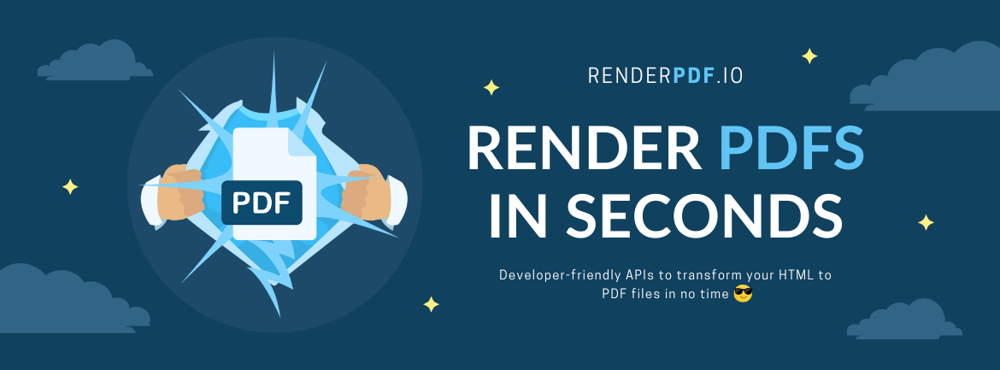

# Render HTML to PDF for Laravel - RenderPDF.io Laravel Driver

[](https://github.com/renderpdf-io/renderpdf-laravel/actions/workflows/build.yml)
[](https://codecov.io/gh/renderpdf-io/renderpdf-laravel)



[RenderPDF.io](https://renderpdf.io) provides awesome & developer-friendly APIs to convert HTML to PDF. 

This is a Laravel package provides an easy integration with **RenderPDF.io**

## Requirement
- PHP 8.1 and above
- Laravel 10 and above

## Installation

```bash
composer install renderpdf-io/renderpdf-laravel
```

Note: for Laravel 10 users, you need to install `GuzzleHTTP` too.

Add the `services.renderpdf-io.key` config into your `config/services.php` (required):

```php
// config/services.php

return [
    'renderpdf-io' => [
        'key' => env('RENDER_PDF_IO_API_KEY'),
    ],
];
```

## Usage

### Facade style

Simply use the `RenderPdfIo` facade

```php
use RenderPdfIo\RenderPdfIo;
use RenderPdfIo\Services\RenderPdfOptions;

public function renderPdf()
{
    $fileUrl = RenderPdfIo::render(new RenderPdfOptions(
        htmlContent: '<p>This is a new PDF</p>',
    ));
}
```

### Dependency Injection style

In case you want to use DI style, we got you:

```php
use RenderPdfIo\Services\RenderPdfIoService;
use RenderPdfIo\Services\RenderPdfOptions;

class InvoiceController
{
    public function download(RenderPdfIoService $renderPdfService)
    {
        $fileUrl = $renderPdfService->render(new RenderPdfOptions(
            htmlContent: '<p>This is a new PDF using DI</p>',
        ));
    }
}
```

See all the available options here: [RenderPdfOptions.php](./src/Services/RenderPdfOptions.php)

## Contributing

Thank you for your consideration to contribute to Laravel library of RenderPDF.io, please feel free to:

- Open an issue for bug reports.
- Submit a PR for improvements/enhancements.

## License
This library is free to use, under [MIT License](./LICENSE).
